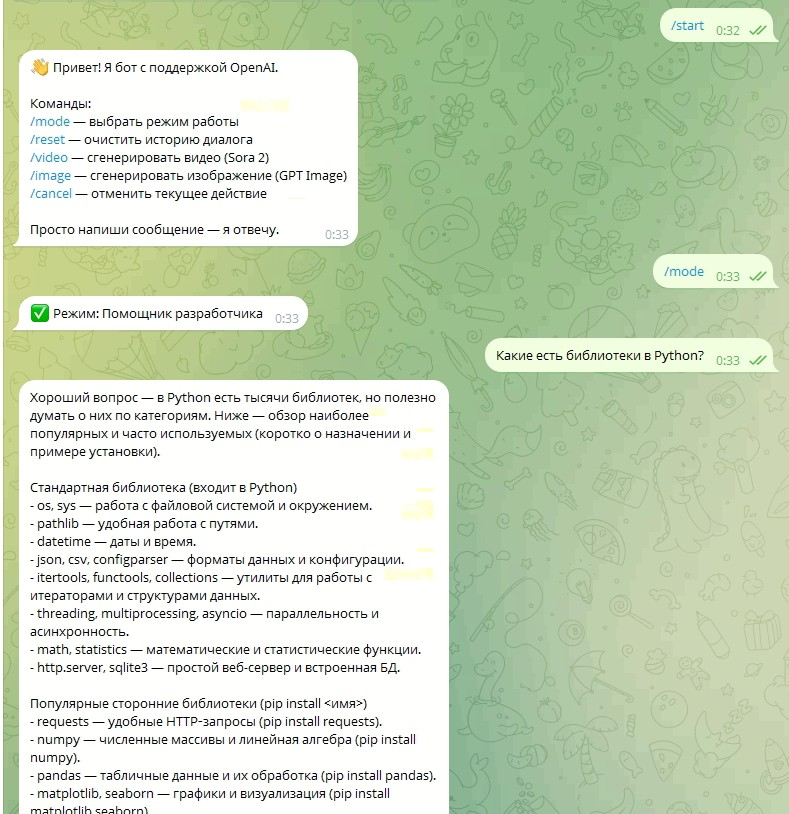
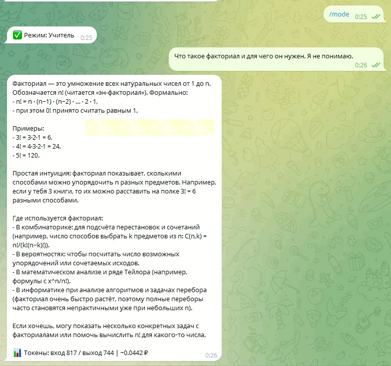

# Telegram-бот с OpenAI (aiogram 3)

## Название проекта

Telegram-бот с поддержкой памяти диалога, переключением режимов, генерацией видео (Sora 2) и интеграцией OpenAI API.

---

## Краткое описание

Бот для Telegram, объединяющий чат с GPT, генерацию изображений (GPT Image) и видео (Sora 2).  
Сохраняет контекст диалога, позволяет переключать режимы (помощник, разработчик, учитель и др.) и показывает примерную стоимость запросов в рублях.

---

## Использованные технологии

| Категория | Технологии |
|-----------|------------|
| Язык | Python 3.10+ |
| Фреймворк бота | aiogram 3.x |
| AI | OpenAI API (GPT, GPT Image, Sora 2) |
| Конфигурация | python-dotenv |
| HTTP-клиент | httpx |
| Хранение данных | JSON-файлы (память, промпты) |
| Внешние API | [API ЦБ РФ](https://www.cbr-xml-daily.ru/) (курс USD/RUB) |

---

## Реализованный функционал

- **Чат с GPT** — текстовые ответы с учётом истории диалога
- **Режимы (промпты)** — смена поведения (помощник, разработчик, учитель и др.) через inline-кнопки
- **Память диалога** — последние N сообщений на чат, хранятся в `memory.json`
- **Генерация изображений** — по текстовому описанию (gpt-image-1-mini)
- **Генерация видео** — 4-секундные ролики по промпту (Sora 2)
- **Стоимость запросов** — отображение токенов и стоимости в рублях (курс ЦБ РФ)
- **Логирование** — события в консоль (сообщения, смена режима, ошибки)

---

## Инструкция по запуску

1. **Клонировать репозиторий** (если есть) или скопировать файлы проекта.

2. **Установить зависимости:**
   ```bash
   pip install -r requirements.txt
   ```

3. **Создать файл `.env`** (скопировать `.env.example`):
   - Windows (cmd): `copy .env.example .env`
   - PowerShell / Linux / macOS: `cp .env.example .env`

4. **Заполнить переменные в `.env`:**

   | Переменная | Описание |
   |------------|----------|
   | `BOT_TOKEN` | Токен от [@BotFather](https://t.me/BotFather) |
   | `OPENAI_API_KEY` | Ключ [OpenAI](https://platform.openai.com/api-keys) |
   | `OPENAI_MODEL` | Модель чата (gpt-5-mini, gpt-4o-mini и т.д.) |
   | `SORA_MODEL` | Модель видео (sora-2, sora-2-pro) |
   | `IMAGE_MODEL` | Модель изображений (gpt-image-1-mini) |
   | `MAX_HISTORY_MESSAGES` | Размер истории диалога (по умолчанию: 10) |

5. **Запустить бота:**
   ```bash
   python main.py
   ```

---

## Доступы

| Ресурс | Ссылка |
|--------|--------|
| Репозиторий | _укажи ссылку на Git_ |
| Бот в Telegram | _укажи @username бота после публикации_ |

---

## Команды бота

| Команда | Действие |
|---------|----------|
| `/start` | Приветствие и список команд |
| `/mode` | Выбор режима (inline-кнопки: помощник, разработчик, учитель и др.) |
| `/reset` | Очистить историю диалога в текущем чате |
| `/video` | Войти в режим генерации видео. Следующее сообщение — промпт → создаётся 4-секундное видео (Sora 2) |
| `/image` | Войти в режим генерации изображений. Следующее сообщение — промпт → создаётся картинка 1024×1024 |
| `/cancel` | Выйти из режима `/video` или `/image` |

Любое текстовое сообщение (кроме команд) обрабатывается как запрос к чату GPT.

---

## Статус проекта

**В разработке**

- Рабочий прототип
- Планируются: доработка обработки ошибок, возможность выбора качества/длительности для видео и изображений, добавить в ответы краткий бейдж активной роли, ограничить глубину памяти и выводить суммарную стоимость сессии; в промптах ролей уточнить стиль и границы

---

## Скриншоты


.jpg)
.jpg)

<!--
Пример:


-->

---

## Планы на будущие версии

- [ ] Выбор качества и разрешения для генерации изображений
- [ ] Выбор длительности видео (4 / 8 / 12 секунд)
- [ ] Webhook вместо long polling для production
- [ ] Админ-команды для статистики
- [ ] Поддержка голосовых сообщений (Speech-to-Text → GPT → ответ)

